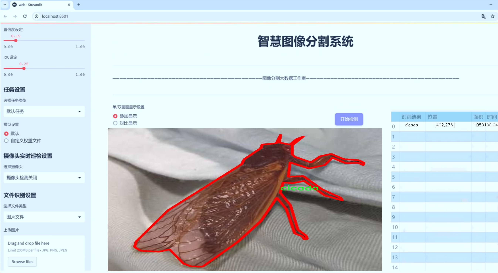
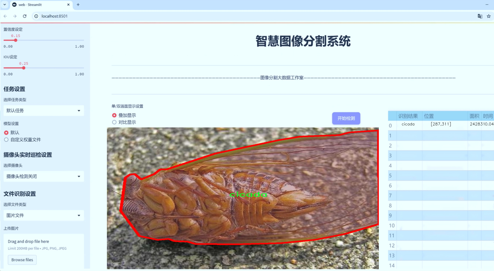
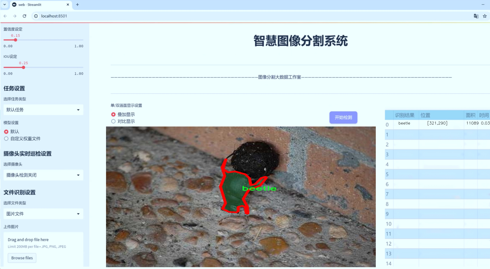
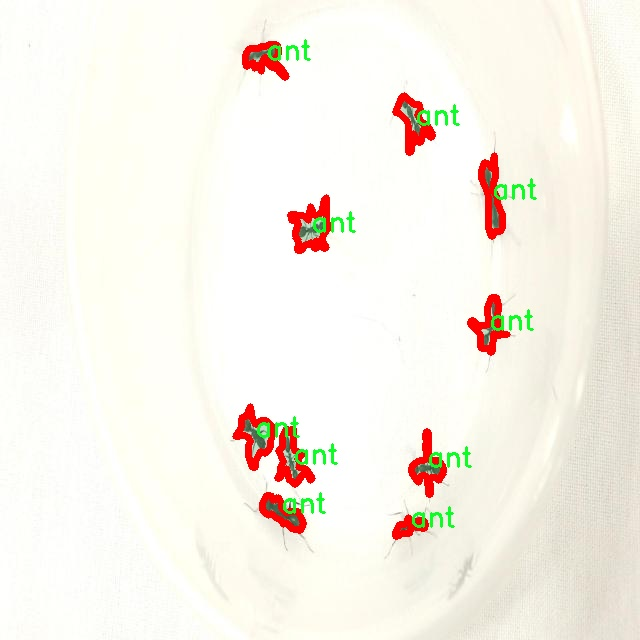
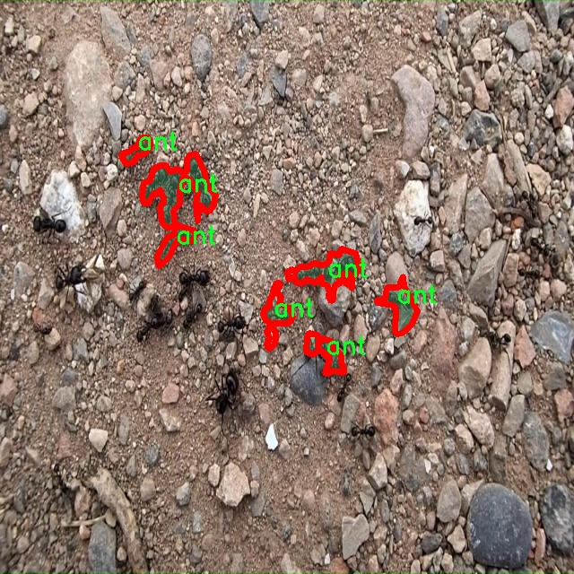
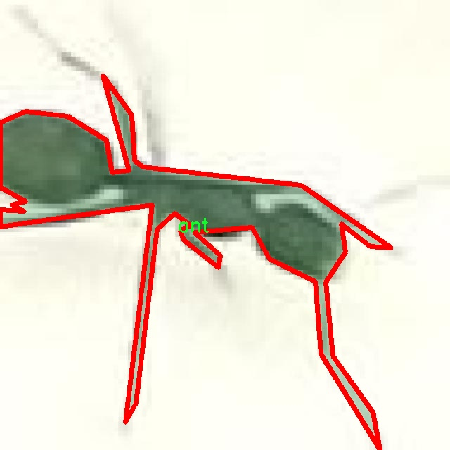
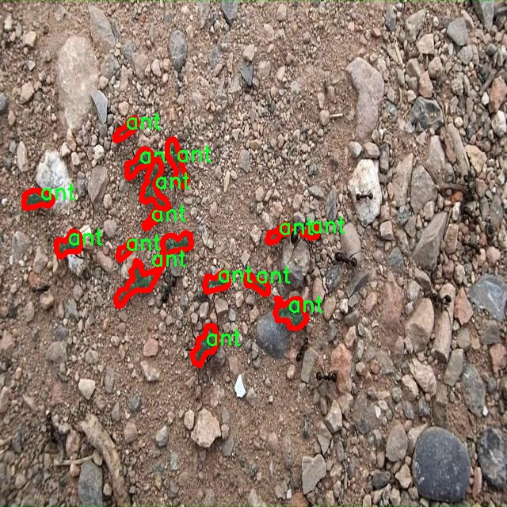
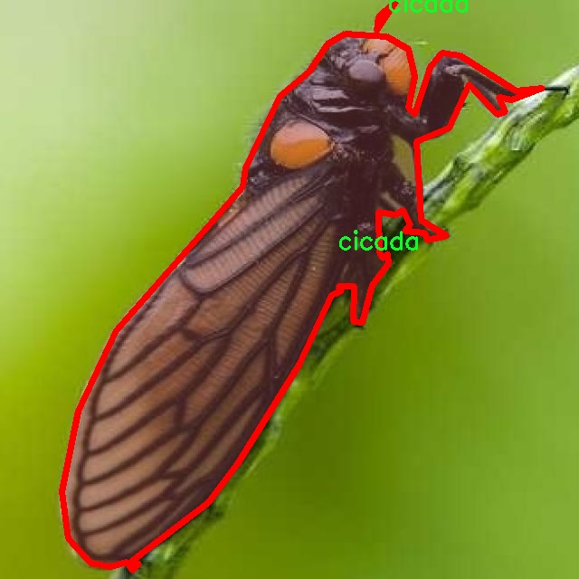

# 昆虫实例分割系统源码＆数据集分享
 [yolov8-seg-C2f-DCNV2-Dynamic＆yolov8-seg-EfficientHead等50+全套改进创新点发刊_一键训练教程_Web前端展示]

### 1.研究背景与意义

项目参考[ILSVRC ImageNet Large Scale Visual Recognition Challenge](https://gitee.com/YOLOv8_YOLOv11_Segmentation_Studio/projects)

项目来源[AAAI Global Al lnnovation Contest](https://kdocs.cn/l/cszuIiCKVNis)

研究背景与意义

在生态学和生物多样性研究中，昆虫作为地球上最丰富的生物类群之一，扮演着重要的角色。昆虫不仅在生态系统中承担着重要的功能，如授粉、分解和食物链的维持，还在农业、医学和环境监测等领域中具有重要的应用价值。然而，随着全球气候变化和人类活动的加剧，昆虫种群的多样性和分布正面临严峻挑战。因此，开展昆虫的监测与研究，尤其是对其种类和数量的精确识别与分割，显得尤为重要。

近年来，深度学习技术的迅猛发展为昆虫的实例分割提供了新的解决方案。YOLO（You Only Look Once）系列模型因其高效的实时检测能力而受到广泛关注。YOLOv8作为该系列的最新版本，结合了更为先进的特征提取和目标检测算法，展现出在多类目标检测中的优越性能。然而，针对昆虫的实例分割任务，现有的YOLOv8模型仍存在一些局限性，如对小目标的检测精度不足、背景复杂时的分割效果不佳等。因此，基于改进YOLOv8的昆虫实例分割系统的研究，具有重要的理论和实践意义。

本研究将使用SnapHatch_Segment数据集，该数据集包含1500幅图像，涵盖75个昆虫类别，涉及从成虫到幼虫、蛹等不同发育阶段的多样性。这一丰富的数据集为模型的训练和验证提供了坚实的基础，使得研究者能够在多样化的背景下，针对不同种类的昆虫进行有效的实例分割。通过对YOLOv8模型的改进，我们期望能够提升其在昆虫实例分割任务中的表现，尤其是在小目标检测和复杂背景下的分割精度。

此外，昆虫实例分割系统的构建不仅能够为生态学研究提供高效的工具，还能够为生物多样性保护、生态监测和农业害虫管理等领域提供数据支持。通过精确识别和分割昆虫种类，研究者能够更好地评估生态系统的健康状况，监测物种的变化趋势，从而为生物多样性保护政策的制定提供科学依据。

综上所述，基于改进YOLOv8的昆虫实例分割系统的研究，不仅具有重要的学术价值，也为实际应用提供了可行的解决方案。通过提升昆虫实例分割的精度和效率，我们能够更好地理解和保护这一重要的生物类群，为可持续发展和生态平衡贡献力量。

### 2.图片演示







##### 注意：由于此博客编辑较早，上面“2.图片演示”和“3.视频演示”展示的系统图片或者视频可能为老版本，新版本在老版本的基础上升级如下：（实际效果以升级的新版本为准）

  （1）适配了YOLOV8的“目标检测”模型和“实例分割”模型，通过加载相应的权重（.pt）文件即可自适应加载模型。

  （2）支持“图片识别”、“视频识别”、“摄像头实时识别”三种识别模式。

  （3）支持“图片识别”、“视频识别”、“摄像头实时识别”三种识别结果保存导出，解决手动导出（容易卡顿出现爆内存）存在的问题，识别完自动保存结果并导出到tempDir中。

  （4）支持Web前端系统中的标题、背景图等自定义修改，后面提供修改教程。

  另外本项目提供训练的数据集和训练教程,暂不提供权重文件（best.pt）,需要您按照教程进行训练后实现图片演示和Web前端界面演示的效果。

### 3.视频演示

[3.1 视频演示](https://www.bilibili.com/video/BV15X2cYJEgF/)

### 4.数据集信息展示

##### 4.1 本项目数据集详细数据（类别数＆类别名）

nc: 76
names: ['Ant', 'annelids', 'ant', 'beetle', 'blood_worm', 'caddis_fly_american_grannom', 'caddis_fly_american_grannom_larva', 'caddis_fly_american_grannom_pupa', 'caddis_fly_green_rock_worm', 'caddis_fly_green_rock_worm_larva', 'caddis_fly_green_rock_worm_pupa', 'caddis_saddle_cased', 'caddis_saddle_cased_larva', 'caddis_saddle_cased_pupa', 'caddis_spotted_sedge', 'caddis_spotted_sedge_larva', 'caddis_spotted_sedge_pupa', 'cicada', 'cricket_black', 'cricket_green', 'damselfly', 'dragonfly', 'dragonfly_nymph', 'fish_eggs', 'flying_ant', 'grasshopper', 'mayfly_blue_winged_olive_dun', 'mayfly_blue_winged_olive_emerger', 'mayfly_blue_winged_olive_nymph', 'mayfly_blue_winged_olive_spinner', 'mayfly_callibaetis_dun', 'mayfly_callibaetis_emerger', 'mayfly_callibaetis_nymph', 'mayfly_callibaetis_spinner', 'mayfly_drake_dun', 'mayfly_drake_emerger', 'mayfly_drake_nymph', 'mayfly_drake_spinner', 'mayfly_hexagenia_dun', 'mayfly_hexagenia_nymph', 'mayfly_hexagenia_spinner', 'mayfly_mahogany_dun', 'mayfly_mahogany_nymph', 'mayfly_mahogany_spinner', 'mayfly_march_brown_dun', 'mayfly_march_brown_nymph', 'mayfly_march_brown_spinner', 'mayfly_pale_morning_dun', 'mayfly_pale_morning_emerger', 'mayfly_pale_morning_nymph', 'mayfly_pale_morning_spinner', 'mayfly_trico_dun', 'mayfly_trico_nymph', 'mayfly_trico_spinner', 'midges', 'midges_emerger', 'midges_larva', 'mosquito', 'mosquito_emerger', 'mosquito_larva', 'october_caddis', 'october_caddis_larva', 'october_caddis_pupa', 'scud', 'snow_bug', 'stonefly_golden', 'stonefly_golden_nymph', 'stonefly_salmonfly', 'stonefly_salmonfly_nymph', 'stonefly_skwala', 'stonefly_skwala_nymph', 'stonefly_summer', 'stonefly_summer_nymph', 'stonefly_yellow_nymph', 'stonefly_yellow_sally', 'water_boatman']


##### 4.2 本项目数据集信息介绍

数据集信息展示

在本研究中，我们使用了名为“SnapHatch_Segment”的数据集，以训练和改进YOLOv8-seg模型，旨在实现高效的昆虫实例分割。该数据集包含76个不同的昆虫类别，涵盖了广泛的生态群体，适用于多种环境和生态研究。数据集的多样性不仅体现在昆虫的种类上，还包括它们的生命周期阶段，如幼虫、成虫和蛹等，这为模型的训练提供了丰富的样本。

“SnapHatch_Segment”数据集的类别列表包括了常见的昆虫种类，如蚂蚁（Ant）、甲虫（beetle）、蝉（cicada）、蟋蟀（cricket）等，此外，还包括多种蜉蝣（mayfly）和石蝇（stonefly）的不同发育阶段。这些类别的多样性使得数据集在昆虫生态学、行为研究以及生物多样性监测等领域具有重要的应用价值。每个类别都经过精心标注，确保在训练过程中，模型能够准确识别和分割不同的昆虫实例。

在具体的类别中，我们可以看到一些特定的昆虫种类，例如“caddis_fly_american_grannom”和其不同生命周期阶段的变体，包括幼虫和蛹。这种细致的分类不仅有助于提高模型的分割精度，还为后续的生态学研究提供了重要的数据支持。此外，数据集中还包含了“mosquito”和“midges”等对公共卫生具有重要意义的昆虫，这使得该数据集在公共卫生监测和防治策略的制定中也具备了潜在的应用前景。

为了确保数据集的有效性和代表性，SnapHatch_Segment在采集过程中遵循了严格的标准，涵盖了多种生态环境和季节变化。这种多样性不仅增强了模型的泛化能力，也使得其在不同环境下的应用更为广泛。例如，数据集中包含的“grasshopper”和“water_boatman”等昆虫，分别代表了陆地和水域生态系统中的重要组成部分，能够帮助研究人员理解不同生态系统中昆虫的生态角色。

此外，数据集的设计还考虑到了昆虫的生活习性和生态交互。例如，蜉蝣的不同发育阶段反映了其在水域生态系统中的重要性，而石蝇的多样性则显示了其在流动水体中的生态适应性。这些信息不仅对模型训练至关重要，也为生态学研究提供了丰富的背景知识。

综上所述，“SnapHatch_Segment”数据集凭借其丰富的类别和详细的标注，为改进YOLOv8-seg的昆虫实例分割系统提供了坚实的基础。通过对该数据集的深入分析和应用，我们期望能够推动昆虫识别技术的发展，进而为生态保护和生物多样性研究提供更为精准和高效的工具。











### 5.全套项目环境部署视频教程（零基础手把手教学）

[5.1 环境部署教程链接（零基础手把手教学）](https://www.bilibili.com/video/BV1jG4Ve4E9t/?vd_source=bc9aec86d164b67a7004b996143742dc)


[5.2 安装Python虚拟环境创建和依赖库安装视频教程链接（零基础手把手教学）](https://www.bilibili.com/video/BV1nA4VeYEze/?vd_source=bc9aec86d164b67a7004b996143742dc)

### 6.手把手YOLOV8-seg训练视频教程（零基础小白有手就能学会）

[6.1 手把手YOLOV8-seg训练视频教程（零基础小白有手就能学会）](https://www.bilibili.com/video/BV1cA4VeYETe/?vd_source=bc9aec86d164b67a7004b996143742dc)


按照上面的训练视频教程链接加载项目提供的数据集，运行train.py即可开始训练



     Epoch   gpu_mem       box       obj       cls    labels  img_size
     1/200     0G   0.01576   0.01955  0.007536        22      1280: 100%|██████████| 849/849 [14:42<00:00,  1.04s/it]
               Class     Images     Labels          P          R     mAP@.5 mAP@.5:.95: 100%|██████████| 213/213 [01:14<00:00,  2.87it/s]
                 all       3395      17314      0.994      0.957      0.0957      0.0843

     Epoch   gpu_mem       box       obj       cls    labels  img_size
     2/200     0G   0.01578   0.01923  0.007006        22      1280: 100%|██████████| 849/849 [14:44<00:00,  1.04s/it]
               Class     Images     Labels          P          R     mAP@.5 mAP@.5:.95: 100%|██████████| 213/213 [01:12<00:00,  2.95it/s]
                 all       3395      17314      0.996      0.956      0.0957      0.0845

     Epoch   gpu_mem       box       obj       cls    labels  img_size
     3/200     0G   0.01561    0.0191  0.006895        27      1280: 100%|██████████| 849/849 [10:56<00:00,  1.29it/s]
               Class     Images     Labels          P          R     mAP@.5 mAP@.5:.95: 100%|███████   | 187/213 [00:52<00:00,  4.04it/s]
                 all       3395      17314      0.996      0.957      0.0957      0.0845


### 7.50+种全套YOLOV8-seg创新点代码加载调参视频教程（一键加载写好的改进模型的配置文件）

[7.1 50+种全套YOLOV8-seg创新点代码加载调参视频教程（一键加载写好的改进模型的配置文件）](https://www.bilibili.com/video/BV1Hw4VePEXv/?vd_source=bc9aec86d164b67a7004b996143742dc)

### 8.YOLOV8-seg图像分割算法原理

原始YOLOV8-seg算法原理

YOLOv8-seg算法是YOLO系列中的最新进展，结合了深度学习领域的前沿技术，特别是在目标检测和图像分割方面的应用。该算法在设计上遵循了YOLO系列一贯的高效性和实时性原则，同时通过一系列创新性改进，提升了模型的性能和适用性。YOLOv8-seg不仅在目标检测上表现优异，还能够实现精确的像素级分割，为复杂场景下的物体识别提供了强有力的支持。

YOLOv8-seg的架构由三个主要部分组成：输入端、主干网络和检测端。输入端负责接收图像数据并进行预处理，以适应后续的特征提取和检测任务。主干网络则是算法的核心，负责从输入图像中提取多层次的特征信息。YOLOv8-seg采用了CSP结构和C2f模块，这一设计不仅提升了特征提取的效率，还增强了模型的表达能力。C2f模块通过引入更多的残差连接，能够在保持轻量化的同时，获取更加丰富的梯度信息，进而提升模型的训练效果。

在特征融合方面，YOLOv8-seg继续采用PAN-FPN结构，这一结构通过自下而上的特征传递和自上而下的特征融合，有效地整合了不同尺度的特征信息。这种多尺度特征融合的策略，使得模型在处理不同大小物体时，能够保持较高的检测精度。同时，YOLOv8-seg在检测端采用了解耦合头结构，将分类和回归任务分开处理，进一步提升了模型的灵活性和准确性。

YOLOv8-seg的创新之处还体现在其损失函数的设计上。算法采用了BCELoss作为分类损失，DFLLoss和CIoULoss作为回归损失，这种多重损失函数的组合，能够更好地平衡分类和定位的精度，确保模型在复杂场景下的鲁棒性。此外，YOLOv8-seg在训练过程中引入了动态Task-Aligned Assigner样本分配策略，能够根据不同任务的需求，灵活调整样本的分配方式，从而提高训练效率和模型的泛化能力。

值得一提的是，YOLOv8-seg在数据增强方面也进行了创新，尤其是在训练的最后阶段，关闭了马赛克增强，这一策略的调整有助于模型更好地适应真实场景中的数据分布，减少过拟合的风险。通过这些改进，YOLOv8-seg在目标检测和图像分割任务中，展现出了更高的精度和更快的推理速度。

YOLOv8-seg的应用场景非常广泛，尤其在农业、自动驾驶、安防监控等领域，均能发挥出其强大的视觉识别能力。以苹果采摘为例，YOLOv8-seg能够快速、准确地识别和定位苹果，为自动采摘机器人提供实时的决策支持。结合蚁群算法进行路径规划，能够使机器人在复杂的果园环境中，快速找到最佳采摘路径，显著提高采摘效率。

总的来说，YOLOv8-seg算法通过一系列创新性设计和改进，提升了目标检测和图像分割的性能，为相关领域的应用提供了新的可能性。其高效的特征提取、多尺度特征融合、灵活的损失函数设计以及先进的数据增强策略，使得YOLOv8-seg在实际应用中表现出色，成为目标检测领域的重要工具。随着技术的不断进步，YOLOv8-seg有望在更多复杂场景中得到应用，推动视觉识别技术的发展。


### 9.系统功能展示（检测对象为举例，实际内容以本项目数据集为准）

图9.1.系统支持检测结果表格显示

  图9.2.系统支持置信度和IOU阈值手动调节

  图9.3.系统支持自定义加载权重文件best.pt(需要你通过步骤5中训练获得)

  图9.4.系统支持摄像头实时识别

  图9.5.系统支持图片识别

  图9.6.系统支持视频识别

  图9.7.系统支持识别结果文件自动保存

  图9.8.系统支持Excel导出检测结果数据


### 10.50+种全套YOLOV8-seg创新点原理讲解（非科班也可以轻松写刊发刊，V11版本正在科研待更新）

#### 10.1 由于篇幅限制，每个创新点的具体原理讲解就不一一展开，具体见下列网址中的创新点对应子项目的技术原理博客网址【Blog】：


[10.1 50+种全套YOLOV8-seg创新点原理讲解链接](https://gitee.com/qunmasj/good)

#### 10.2 部分改进模块原理讲解(完整的改进原理见上图和技术博客链接)【此小节的图要是加载失败请移步原始博客查看，链接：https://blog.csdn.net/cheng2333333?type=blog】
### YOLOv8算法原理
YOLOv8算法由Glenn-Jocher 提出，是跟YOLOv3算法、YOLOv5算法一脉相承的，主要的改进点如下:
(1)数据预处理。YOLOv8的数据预处理依旧采用YOLOv5的策略,在训练时，主要采用包括马赛克增强(Mosaic)、混合增强(Mixup)、空间扰动(randomperspective)以及颜色扰动(HSV augment)四个增强手段。
(2)骨干网络结构。YOLOv8的骨干网络结构可从YOLOv5略见一斑，YOLOv5的主干网络的架构规律十分清晰，总体来看就是每用一层步长为2的3×3卷积去降采样特征图，接一个C3模块来进一步强化其中的特征，且C3的基本深度参数分别为“3/6/9/3”，其会根据不同规模的模型的来做相应的缩放。在的YOLOv8中，大体上也还是继承了这一特点，原先的C3模块均被替换成了新的C2f模块，C2f 模块加入更多的分支，丰富梯度回传时的支流。下面展示了YOLOv8的C2f模块和YOLOv5的C3模块，其网络结构图所示。


(3)FPN-PAN结构。YOLOv8仍采用FPN+PAN结构来构建YOLO的特征金字塔，使多尺度信息之间进行充分的融合。除了FPN-PAN里面的C3模块被替换为C2f模块外，其余部分与YOLOv5的FPN-PAN结构基本一致。
(4)Detection head结构。从 YOLOv3到 YOLOv5，其检测头一直都是“耦合”(Coupled)的,即使用一层卷积同时完成分类和定位两个任务，直到YOLOX的问世， YOLO系列才第一次换装“解耦头”(Decoupled Head)。YOLOv8也同样也采用了解耦头的结构，两条并行的分支分别取提取类别特征和位置特征，然后各用一层1x1卷积完成分类和定位任务。YOLOv8整体的网络结构由图所示。


(5)标签分配策略。尽管YOLOv5设计了自动聚类候选框的一些功能，但是聚类候选框是依赖于数据集的。若数据集不够充分，无法较为准确地反映数据本身的分布特征，聚类出来的候选框也会与真实物体尺寸比例悬殊过大。YOLOv8没有采用候选框策略，所以解决的问题就是正负样本匹配的多尺度分配。不同于YOLOX所使用的 SimOTA，YOLOv8在标签分配问题上采用了和YOLOv6相同的TOOD策略，是一种动态标签分配策略。YOLOv8只用到了targetboze。和target scores，未含是否有物体预测，故 YOLOv8的损失就主要包括两大部分∶类别损失和位置损失。对于YOLOv8，其分类损失为VFLLoss(Varifocal Loss)，其回归损失为CIoU Loss 与 DFL Loss 的形式。
其中 Varifocal Loss定义如下:


其中p为预测的类别得分，p ∈ [0.1]。q为预测的目标分数(若为真实类别，则q为预测和真值的 loU;若为其他类别。q为0 )。VFL Loss使用不对称参数来对正负样本进行加权，通过只对负样本进行衰减，达到不对等的处理前景和背景对损失的贡献。对正样本，使用q进行了加权，如果正样本的GTiou很高时,则对损失的贡献更大一些，可以让网络聚焦于那些高质量的样本上，即训练高质量的正例对AP的提升比低质量的更大一些。对负样本，使用p进行了降权，降低了负例对损失的贡献，因负样本的预测p在取次幂后会变得更小，这样就能够降低负样本对损失的整体贡献。

### 动态蛇形卷积Dynamic Snake Convolution

参考论文： 2307.08388.pdf (arxiv.org)

血管、道路等拓扑管状结构的精确分割在各个领域都至关重要，确保下游任务的准确性和效率。 然而，许多因素使任务变得复杂，包括薄的局部结构和可变的全局形态。在这项工作中，我们注意到管状结构的特殊性，并利用这些知识来指导我们的 DSCNet 在三个阶段同时增强感知：特征提取、特征融合、 和损失约束。 首先，我们提出了一种动态蛇卷积，通过自适应地关注细长和曲折的局部结构来准确捕获管状结构的特征。 随后，我们提出了一种多视图特征融合策略，以补充特征融合过程中多角度对特征的关注，确保保留来自不同全局形态的重要信息。 最后，提出了一种基于持久同源性的连续性约束损失函数，以更好地约束分割的拓扑连续性。 2D 和 3D 数据集上的实验表明，与多种方法相比，我们的 DSCNet 在管状结构分割任务上提供了更好的准确性和连续性。 我们的代码是公开的。 
主要的挑战源于细长微弱的局部结构特征与复杂多变的全局形态特征。本文关注到管状结构细长连续的特点，并利用这一信息在神经网络以下三个阶段同时增强感知：特征提取、特征融合和损失约束。分别设计了动态蛇形卷积（Dynamic Snake Convolution），多视角特征融合策略与连续性拓扑约束损失。 

我们希望卷积核一方面能够自由地贴合结构学习特征，另一方面能够在约束条件下不偏离目标结构太远。在观察管状结构的细长连续的特征后，脑海里想到了一个动物——蛇。我们希望卷积核能够像蛇一样动态地扭动，来贴合目标的结构。

我们希望卷积核一方面能够自由地贴合结构学习特征，另一方面能够在约束条件下不偏离目标结构太远。在观察管状结构的细长连续的特征后，脑海里想到了一个动物——蛇。我们希望卷积核能够像蛇一样动态地扭动，来贴合目标的结构。


### DCNV2融入YOLOv8
DCN和DCNv2（可变性卷积）
网上关于两篇文章的详细描述已经很多了，我这里具体的细节就不多讲了，只说一下其中实现起来比较困惑的点。（黑体字会讲解）

DCNv1解决的问题就是我们常规的图像增强，仿射变换（线性变换加平移）不能解决的多种形式目标变换的几何变换的问题。如下图所示。

可变性卷积的思想很简单，就是讲原来固定形状的卷积核变成可变的。如下图所示：


首先来看普通卷积，以3x3卷积为例对于每个输出y(p0)，都要从x上采样9个位置，这9个位置都在中心位置x(p0)向四周扩散得到的gird形状上，(-1,-1)代表x(p0)的左上角，(1,1)代表x(p0)的右下角，其他类似。

用公式表示如下：


可变性卷积Deformable Conv操作并没有改变卷积的计算操作，而是在卷积操作的作用区域上，加入了一个可学习的参数∆pn。同样对于每个输出y(p0)，都要从x上采样9个位置，这9个位置是中心位置x(p0)向四周扩散得到的，但是多了 ∆pn，允许采样点扩散成非gird形状。


偏移量是通过对原始特征层进行卷积得到的。比如输入特征层是w×h×c，先对输入的特征层进行卷积操作，得到w×h×2c的offset field。这里的w和h和原始特征层的w和h是一致的，offset field里面的值是输入特征层对应位置的偏移量，偏移量有x和y两个方向，所以offset field的channel数是2c。offset field里的偏移量是卷积得到的，可能是浮点数，所以接下来需要通过双向性插值计算偏移位置的特征值。在偏移量的学习中，梯度是通过双线性插值来进行反向传播的。
看到这里是不是还是有点迷茫呢？那到底程序上面怎么实现呢？


事实上由上面的公式我们可以看得出来∆pn这个偏移量是加在原像素点上的，但是我们怎么样从代码上对原像素点加这个量呢？其实很简单，就是用一个普通的卷积核去跟输入图片（一般是输入的feature_map）卷积就可以了卷积核的数量是2N也就是23*3==18（前9个通道是x方向的偏移量，后9个是y方向的偏移量），然后把这个卷积的结果与正常卷积的结果进行相加就可以了。
然后又有了第二个问题，怎么样反向传播呢？为什么会有这个问题呢？因为求出来的偏移量+正常卷积输出的结果往往是一个浮点数，浮点数是无法对应到原图的像素点的，所以自然就想到了双线性差值的方法求出浮点数对应的浮点像素点。


#### DCN v2
对于positive的样本来说，采样的特征应该focus在RoI内，如果特征中包含了过多超出RoI的内容，那么结果会受到影响和干扰。而negative样本则恰恰相反，引入一些超出RoI的特征有助于帮助网络判别这个区域是背景区域。

DCNv1引入了可变形卷积，能更好的适应目标的几何变换。但是v1可视化结果显示其感受野对应位置超出了目标范围，导致特征不受图像内容影响（理想情况是所有的对应位置分布在目标范围以内）。

为了解决该问题：提出v2, 主要有

1、扩展可变形卷积，增强建模能力
2、提出了特征模拟方案指导网络培训：feature mimicking scheme

上面这段话是什么意思呢，通俗来讲就是，我们的可变性卷积的区域大于目标所在区域，所以这时候就会对非目标区域进行错误识别。

所以自然能想到的解决方案就是加入权重项进行惩罚。（至于这个实现起来就比较简单了，直接初始化一个权重然后乘(input+offsets)就可以了）


可调节的RoIpooling也是类似的，公式如下：


### 11.项目核心源码讲解（再也不用担心看不懂代码逻辑）

#### 11.1 ultralytics\models\yolo\model.py

以下是经过精简和注释的核心代码部分：

```python
# 引入必要的模块和类
from ultralytics.engine.model import Model
from ultralytics.models import yolo  # 引入YOLO模型相关的模块
from ultralytics.nn.tasks import ClassificationModel, DetectionModel, PoseModel, SegmentationModel

class YOLO(Model):
    """YOLO (You Only Look Once) 目标检测模型类。"""

    @property
    def task_map(self):
        """将任务类型映射到相应的模型、训练器、验证器和预测器类。"""
        return {
            'classify': {  # 分类任务
                'model': ClassificationModel,  # 分类模型
                'trainer': yolo.classify.ClassificationTrainer,  # 分类训练器
                'validator': yolo.classify.ClassificationValidator,  # 分类验证器
                'predictor': yolo.classify.ClassificationPredictor,  # 分类预测器
            },
            'detect': {  # 检测任务
                'model': DetectionModel,  # 检测模型
                'trainer': yolo.detect.DetectionTrainer,  # 检测训练器
                'validator': yolo.detect.DetectionValidator,  # 检测验证器
                'predictor': yolo.detect.DetectionPredictor,  # 检测预测器
            },
            'segment': {  # 分割任务
                'model': SegmentationModel,  # 分割模型
                'trainer': yolo.segment.SegmentationTrainer,  # 分割训练器
                'validator': yolo.segment.SegmentationValidator,  # 分割验证器
                'predictor': yolo.segment.SegmentationPredictor,  # 分割预测器
            },
            'pose': {  # 姿态估计任务
                'model': PoseModel,  # 姿态模型
                'trainer': yolo.pose.PoseTrainer,  # 姿态训练器
                'validator': yolo.pose.PoseValidator,  # 姿态验证器
                'predictor': yolo.pose.PosePredictor,  # 姿态预测器
            },
        }
```

### 代码说明：
1. **引入模块**：首先引入了YOLO模型相关的模块和类，以便后续使用。
2. **YOLO类**：定义了一个名为`YOLO`的类，继承自`Model`类，表示YOLO目标检测模型。
3. **task_map属性**：这是一个属性方法，返回一个字典，字典的键是任务类型（如分类、检测、分割、姿态），值是一个包含模型、训练器、验证器和预测器的字典。这样做的目的是为了根据不同的任务类型方便地获取相应的类。

### 核心功能：
- 通过`task_map`，用户可以轻松地根据任务类型选择合适的模型和相关组件，增强了代码的可扩展性和灵活性。

这个文件定义了一个名为 `YOLO` 的类，该类继承自 `Model`，主要用于实现 YOLO（You Only Look Once）目标检测模型。YOLO 是一种广泛使用的深度学习模型，主要用于实时目标检测。

在 `YOLO` 类中，有一个名为 `task_map` 的属性，它返回一个字典，该字典将不同的任务类型（如分类、检测、分割和姿态估计）映射到相应的模型、训练器、验证器和预测器类。这种设计使得 `YOLO` 类能够灵活地处理多种计算机视觉任务。

具体来说，`task_map` 字典的结构如下：

- 对于分类任务（`classify`），它映射到 `ClassificationModel` 作为模型，`ClassificationTrainer` 作为训练器，`ClassificationValidator` 作为验证器，以及 `ClassificationPredictor` 作为预测器。
- 对于检测任务（`detect`），它映射到 `DetectionModel`、`DetectionTrainer`、`DetectionValidator` 和 `DetectionPredictor`。
- 对于分割任务（`segment`），它映射到 `SegmentationModel`、`SegmentationTrainer`、`SegmentationValidator` 和 `SegmentationPredictor`。
- 对于姿态估计任务（`pose`），它映射到 `PoseModel`、`PoseTrainer`、`PoseValidator` 和 `PosePredictor`。

这种结构化的映射关系使得在使用 YOLO 模型时，可以方便地选择适合特定任务的组件，提升了代码的可维护性和扩展性。总的来说，这个文件为 YOLO 模型的多任务处理提供了基础框架，便于后续的模型训练、验证和预测操作。

#### 11.2 ui.py

以下是代码中最核心的部分，并附上详细的中文注释：

```python
import sys
import subprocess

def run_script(script_path):
    """
    使用当前 Python 环境运行指定的脚本。

    Args:
        script_path (str): 要运行的脚本路径

    Returns:
        None
    """
    # 获取当前 Python 解释器的路径
    python_path = sys.executable

    # 构建运行命令，使用 streamlit 运行指定的脚本
    command = f'"{python_path}" -m streamlit run "{script_path}"'

    # 执行命令，并等待其完成
    result = subprocess.run(command, shell=True)
    
    # 检查命令执行的返回码，如果不为0则表示出错
    if result.returncode != 0:
        print("脚本运行出错。")

# 实例化并运行应用
if __name__ == "__main__":
    # 指定要运行的脚本路径
    script_path = "web.py"  # 这里可以替换为实际的脚本路径

    # 调用函数运行脚本
    run_script(script_path)
```

### 代码注释说明：
1. **导入模块**：
   - `sys`：用于访问与 Python 解释器相关的变量和函数。
   - `subprocess`：用于执行外部命令和与其交互。

2. **定义 `run_script` 函数**：
   - 该函数接受一个参数 `script_path`，表示要运行的 Python 脚本的路径。
   - 函数内部首先获取当前 Python 解释器的路径，然后构建一个命令字符串，使用 `streamlit` 来运行指定的脚本。

3. **执行命令**：
   - 使用 `subprocess.run` 方法执行构建的命令，并等待命令执行完成。
   - 通过检查 `result.returncode` 来判断命令是否成功执行，如果返回码不为0，则打印错误信息。

4. **主程序入口**：
   - 在 `if __name__ == "__main__":` 块中，指定要运行的脚本路径，并调用 `run_script` 函数来执行该脚本。

这个程序文件的主要功能是通过当前的 Python 环境来运行一个指定的脚本，具体是一个名为 `web.py` 的文件。程序首先导入了必要的模块，包括 `sys`、`os` 和 `subprocess`，这些模块分别用于访问系统特性、操作系统功能和执行外部命令。

在文件中定义了一个名为 `run_script` 的函数，该函数接受一个参数 `script_path`，表示要运行的脚本的路径。函数内部首先获取当前 Python 解释器的路径，这通过 `sys.executable` 实现。接着，构建一个命令字符串，使用 `streamlit` 模块来运行指定的脚本。这个命令的格式是将 Python 解释器的路径和要运行的脚本路径组合在一起，形成一个完整的命令。

然后，使用 `subprocess.run` 方法来执行这个命令，`shell=True` 参数表示在一个新的 shell 中执行命令。执行后，程序会检查返回的结果码，如果结果码不为零，说明脚本运行过程中出现了错误，此时会打印出“脚本运行出错”的提示信息。

在文件的最后部分，使用 `if __name__ == "__main__":` 语句来确保只有在直接运行该文件时才会执行下面的代码。这里指定了要运行的脚本路径为 `web.py`，并调用 `run_script` 函数来执行这个脚本。

整体来看，这个程序的目的是为了方便地通过 Python 环境来启动一个基于 Streamlit 的 Web 应用。

#### 11.3 ultralytics\utils\dist.py

以下是代码中最核心的部分，并附上详细的中文注释：

```python
import os
import re
import shutil
import socket
import sys
import tempfile
from pathlib import Path

def find_free_network_port() -> int:
    """
    查找本地主机上可用的端口。

    在单节点训练时，如果不想连接到真实的主节点，但必须设置
    `MASTER_PORT` 环境变量时，这个函数非常有用。
    """
    with socket.socket(socket.AF_INET, socket.SOCK_STREAM) as s:
        s.bind(('127.0.0.1', 0))  # 绑定到本地地址和随机端口
        return s.getsockname()[1]  # 返回绑定的端口号


def generate_ddp_file(trainer):
    """生成 DDP 文件并返回其文件名。"""
    # 获取训练器的模块和类名
    module, name = f'{trainer.__class__.__module__}.{trainer.__class__.__name__}'.rsplit('.', 1)

    # 创建 DDP 文件的内容
    content = f'''overrides = {vars(trainer.args)} \nif __name__ == "__main__":
    from {module} import {name}
    from ultralytics.utils import DEFAULT_CFG_DICT

    cfg = DEFAULT_CFG_DICT.copy()
    cfg.update(save_dir='')   # 处理额外的键 'save_dir'
    trainer = {name}(cfg=cfg, overrides=overrides)
    trainer.train()'''
    
    # 创建 DDP 目录
    (USER_CONFIG_DIR / 'DDP').mkdir(exist_ok=True)
    
    # 创建临时文件并写入内容
    with tempfile.NamedTemporaryFile(prefix='_temp_',
                                     suffix=f'{id(trainer)}.py',
                                     mode='w+',
                                     encoding='utf-8',
                                     dir=USER_CONFIG_DIR / 'DDP',
                                     delete=False) as file:
        file.write(content)  # 写入生成的内容
    return file.name  # 返回临时文件的名称


def generate_ddp_command(world_size, trainer):
    """生成并返回用于分布式训练的命令。"""
    import __main__  # 本地导入以避免某些问题
    if not trainer.resume:
        shutil.rmtree(trainer.save_dir)  # 如果不恢复训练，删除保存目录

    file = str(Path(sys.argv[0]).resolve())  # 获取当前脚本的绝对路径
    safe_pattern = re.compile(r'^[a-zA-Z0-9_. /\\-]{1,128}$')  # 允许的字符和最大长度
    # 检查文件名是否安全且存在
    if not (safe_pattern.match(file) and Path(file).exists() and file.endswith('.py')):
        file = generate_ddp_file(trainer)  # 生成 DDP 文件

    dist_cmd = 'torch.distributed.run' if TORCH_1_9 else 'torch.distributed.launch'  # 根据 PyTorch 版本选择命令
    port = find_free_network_port()  # 查找可用端口
    # 构建命令列表
    cmd = [sys.executable, '-m', dist_cmd, '--nproc_per_node', f'{world_size}', '--master_port', f'{port}', file]
    return cmd, file  # 返回命令和文件名


def ddp_cleanup(trainer, file):
    """如果创建了临时文件，则删除它。"""
    if f'{id(trainer)}.py' in file:  # 检查文件名是否包含临时文件的后缀
        os.remove(file)  # 删除临时文件
```

### 代码核心功能概述：
1. **查找可用端口**：`find_free_network_port` 函数用于查找本地主机上可用的网络端口，方便进行分布式训练时的通信。
2. **生成 DDP 文件**：`generate_ddp_file` 函数根据训练器的参数生成一个临时的 DDP 文件，以便在分布式训练中使用。
3. **生成训练命令**：`generate_ddp_command` 函数生成用于启动分布式训练的命令，包括必要的参数和配置。
4. **清理临时文件**：`ddp_cleanup` 函数用于在训练结束后删除生成的临时文件，保持文件系统的整洁。

这个程序文件是用于处理分布式训练的工具，主要涉及到在使用Ultralytics YOLO框架时的分布式数据并行（DDP）设置。代码的主要功能包括查找可用的网络端口、生成用于分布式训练的Python文件、生成分布式训练的命令以及清理临时文件。

首先，程序导入了一些必要的模块，包括操作系统、正则表达式、文件处理、网络通信、系统信息、临时文件和路径处理等。它还导入了用户配置目录和Torch的版本信息。

`find_free_network_port`函数用于查找本地主机上可用的网络端口。这在单节点训练时非常有用，因为我们不想连接到真实的主节点，但仍需要设置`MASTER_PORT`环境变量。该函数通过创建一个TCP套接字并绑定到本地地址和随机端口来实现，返回找到的可用端口号。

`generate_ddp_file`函数用于生成一个DDP文件并返回其文件名。它根据传入的训练器对象生成相应的Python代码，并将其写入一个临时文件中。生成的代码包括训练器的参数和训练过程的调用。临时文件存储在用户配置目录下的`DDP`文件夹中，确保文件夹存在。

`generate_ddp_command`函数用于生成分布式训练的命令。它首先检查训练器是否需要恢复训练，如果不需要，则删除保存目录。接着，它获取当前脚本的路径，并使用正则表达式检查文件名是否合法。如果文件名不符合要求，则调用`generate_ddp_file`生成一个新的文件。然后，构建分布式训练的命令，使用合适的Torch分布式运行模块，并查找可用的网络端口，最终返回命令和文件名。

最后，`ddp_cleanup`函数用于在训练结束后删除临时文件。如果生成的临时文件的后缀与训练器的ID匹配，则执行删除操作，以清理不再需要的文件。

整体来看，这个文件为Ultralytics YOLO框架提供了分布式训练的支持，确保在多GPU环境下能够有效地管理训练过程。

#### 11.4 train.py

以下是经过简化和注释的核心代码部分：

```python
import os
import torch
import yaml
from ultralytics import YOLO  # 导入YOLO模型

if __name__ == '__main__':  # 确保该模块被直接运行时才执行以下代码
    # 设置训练参数
    workers = 1  # 数据加载的工作进程数量
    batch = 8  # 每个批次的样本数量
    device = "0" if torch.cuda.is_available() else "cpu"  # 检查是否有可用的GPU

    # 获取数据集的yaml配置文件的绝对路径
    data_path = abs_path(f'datasets/data/data.yaml', path_type='current')

    # 将路径转换为Unix风格
    unix_style_path = data_path.replace(os.sep, '/')
    # 获取目录路径
    directory_path = os.path.dirname(unix_style_path)

    # 读取YAML文件，保持原有顺序
    with open(data_path, 'r') as file:
        data = yaml.load(file, Loader=yaml.FullLoader)

    # 修改YAML文件中的路径项
    if 'train' in data and 'val' in data and 'test' in data:
        data['train'] = directory_path + '/train'  # 更新训练集路径
        data['val'] = directory_path + '/val'      # 更新验证集路径
        data['test'] = directory_path + '/test'    # 更新测试集路径

        # 将修改后的数据写回YAML文件
        with open(data_path, 'w') as file:
            yaml.safe_dump(data, file, sort_keys=False)

    # 加载YOLO模型配置和预训练权重
    model = YOLO(r"C:\codeseg\codenew\50+种YOLOv8算法改进源码大全和调试加载训练教程（非必要）\改进YOLOv8模型配置文件\yolov8-seg-C2f-Faster.yaml").load("./weights/yolov8s-seg.pt")

    # 开始训练模型
    results = model.train(
        data=data_path,  # 指定训练数据的配置文件路径
        device=device,  # 使用的设备（GPU或CPU）
        workers=workers,  # 数据加载的工作进程数量
        imgsz=640,  # 输入图像的大小
        epochs=100,  # 训练的轮数
        batch=batch,  # 每个批次的样本数量
    )
```

### 代码注释说明：
1. **导入库**：导入必要的库，包括操作系统、PyTorch、YAML解析器和YOLO模型。
2. **主程序入口**：通过`if __name__ == '__main__':`确保代码只在直接运行时执行。
3. **训练参数设置**：
   - `workers`：设置数据加载的工作进程数量。
   - `batch`：设置每个批次的样本数量。
   - `device`：检查是否有可用的GPU，并设置为相应的设备。
4. **数据路径处理**：
   - 获取数据集配置文件的绝对路径，并转换为Unix风格的路径。
   - 读取YAML文件，更新训练、验证和测试集的路径。
5. **模型加载**：加载YOLO模型的配置文件和预训练权重。
6. **模型训练**：调用`model.train()`方法开始训练，传入必要的参数，如数据路径、设备、工作进程数量、图像大小、训练轮数和批次大小。

这个程序文件 `train.py` 是用于训练 YOLO（You Only Look Once）模型的脚本，主要使用了 PyTorch 框架和 Ultraytics 提供的 YOLO 实现。以下是对代码的逐行讲解。

首先，程序导入了必要的库，包括 `os`、`torch`、`yaml`、`ultralytics` 中的 YOLO 模型、`QtFusion` 中的路径处理工具以及 `matplotlib`。其中，`matplotlib` 被设置为使用 `TkAgg` 后端，这通常用于图形界面的显示。

接下来，程序在 `__main__` 块中开始执行。首先定义了一些训练参数，包括 `workers`（工作进程数）、`batch`（每个批次的样本数）和 `device`（计算设备，优先使用 GPU，如果不可用则使用 CPU）。`batch` 的值可以根据计算机的显存和内存进行调整，以避免显存溢出。

然后，程序获取数据集配置文件的绝对路径，该配置文件是一个 YAML 文件，包含了训练、验证和测试数据的路径。使用 `abs_path` 函数将相对路径转换为绝对路径，并将路径中的分隔符统一为 Unix 风格的斜杠。

接下来，程序读取 YAML 文件并将其内容加载到 `data` 变量中。它检查 YAML 文件中是否包含 `train`、`val` 和 `test` 三个字段，如果存在，则将这些字段的值修改为当前目录下的 `train`、`val` 和 `test` 子目录的路径。修改后的数据会被写回到原 YAML 文件中，以确保后续训练能够正确找到数据集。

程序中有一段注释，提醒用户不同的模型对设备的要求不同，如果当前模型在训练时出现错误，可以尝试使用其他模型配置文件。

接下来，程序加载了一个 YOLO 模型的配置文件，并使用预训练的权重文件进行初始化。模型配置文件的路径和权重文件的路径都是硬编码的，用户需要根据自己的文件结构进行调整。

最后，程序调用 `model.train()` 方法开始训练模型。训练过程中指定了数据配置文件的路径、计算设备、工作进程数、输入图像的大小（640x640）、训练的轮数（100个 epoch）以及每个批次的大小（8）。训练结果会被存储在 `results` 变量中。

总体而言，这个脚本的功能是设置并启动 YOLO 模型的训练过程，确保数据路径正确，模型配置合适，并且可以根据硬件条件进行调整。

#### 11.5 ultralytics\nn\backbone\fasternet.py

以下是代码中最核心的部分，并附上详细的中文注释：

```python
import torch
import torch.nn as nn
from typing import List
from torch import Tensor

class Partial_conv3(nn.Module):
    """
    实现部分卷积的类，用于在特定通道上进行卷积操作。
    """

    def __init__(self, dim, n_div, forward):
        super().__init__()
        self.dim_conv3 = dim // n_div  # 计算需要进行卷积的通道数
        self.dim_untouched = dim - self.dim_conv3  # 计算未被卷积的通道数
        self.partial_conv3 = nn.Conv2d(self.dim_conv3, self.dim_conv3, 3, 1, 1, bias=False)  # 定义卷积层

        # 根据前向传播方式选择不同的前向传播函数
        if forward == 'slicing':
            self.forward = self.forward_slicing
        elif forward == 'split_cat':
            self.forward = self.forward_split_cat
        else:
            raise NotImplementedError

    def forward_slicing(self, x: Tensor) -> Tensor:
        # 仅用于推理阶段
        x = x.clone()  # 克隆输入以保持原始输入不变
        x[:, :self.dim_conv3, :, :] = self.partial_conv3(x[:, :self.dim_conv3, :, :])  # 对前部分通道进行卷积
        return x

    def forward_split_cat(self, x: Tensor) -> Tensor:
        # 用于训练和推理阶段
        x1, x2 = torch.split(x, [self.dim_conv3, self.dim_untouched], dim=1)  # 将输入分为两部分
        x1 = self.partial_conv3(x1)  # 对第一部分进行卷积
        x = torch.cat((x1, x2), 1)  # 将卷积后的部分与未卷积的部分拼接
        return x


class MLPBlock(nn.Module):
    """
    实现多层感知机（MLP）块的类，包含卷积、归一化和激活函数。
    """

    def __init__(self, dim, n_div, mlp_ratio, drop_path, layer_scale_init_value, act_layer, norm_layer, pconv_fw_type):
        super().__init__()
        self.dim = dim
        self.mlp_ratio = mlp_ratio
        self.drop_path = nn.Identity() if drop_path <= 0 else DropPath(drop_path)  # 根据drop_path值选择是否使用DropPath
        self.n_div = n_div

        mlp_hidden_dim = int(dim * mlp_ratio)  # 计算MLP隐藏层的维度

        # 定义MLP的层
        mlp_layer: List[nn.Module] = [
            nn.Conv2d(dim, mlp_hidden_dim, 1, bias=False),
            norm_layer(mlp_hidden_dim),
            act_layer(),
            nn.Conv2d(mlp_hidden_dim, dim, 1, bias=False)
        ]

        self.mlp = nn.Sequential(*mlp_layer)  # 将MLP层组合成一个顺序模块
        self.spatial_mixing = Partial_conv3(dim, n_div, pconv_fw_type)  # 定义空间混合层

    def forward(self, x: Tensor) -> Tensor:
        shortcut = x  # 保存输入以便后续残差连接
        x = self.spatial_mixing(x)  # 进行空间混合
        x = shortcut + self.drop_path(self.mlp(x))  # 添加残差连接
        return x


class FasterNet(nn.Module):
    """
    FasterNet模型的实现，包含多个阶段和嵌入层。
    """

    def __init__(self, in_chans=3, num_classes=1000, embed_dim=96, depths=(1, 2, 8, 2), mlp_ratio=2., n_div=4,
                 patch_size=4, patch_stride=4, patch_size2=2, patch_stride2=2, patch_norm=True, drop_path_rate=0.1,
                 layer_scale_init_value=0, norm_layer='BN', act_layer='RELU', pconv_fw_type='split_cat'):
        super().__init__()

        # 选择归一化层和激活函数
        norm_layer = nn.BatchNorm2d if norm_layer == 'BN' else NotImplementedError
        act_layer = nn.GELU if act_layer == 'GELU' else partial(nn.ReLU, inplace=True)

        self.num_stages = len(depths)  # 计算阶段数量
        self.embed_dim = embed_dim  # 嵌入维度
        self.patch_embed = PatchEmbed(patch_size, patch_stride, in_chans, embed_dim, norm_layer if patch_norm else None)  # 定义Patch嵌入层

        # 构建每个阶段的层
        stages_list = []
        for i_stage in range(self.num_stages):
            stage = BasicStage(dim=int(embed_dim * 2 ** i_stage), n_div=n_div, depth=depths[i_stage],
                               mlp_ratio=mlp_ratio, drop_path=drop_path_rate, layer_scale_init_value=layer_scale_init_value,
                               norm_layer=norm_layer, act_layer=act_layer, pconv_fw_type=pconv_fw_type)
            stages_list.append(stage)

            # 添加Patch合并层
            if i_stage < self.num_stages - 1:
                stages_list.append(PatchMerging(patch_size2=patch_size2, patch_stride2=patch_stride2,
                                                 dim=int(embed_dim * 2 ** i_stage), norm_layer=norm_layer))

        self.stages = nn.Sequential(*stages_list)  # 将所有阶段组合成一个顺序模块

    def forward(self, x: Tensor) -> Tensor:
        # 输出四个阶段的特征用于密集预测
        x = self.patch_embed(x)  # 进行Patch嵌入
        outs = []
        for idx, stage in enumerate(self.stages):
            x = stage(x)  # 通过每个阶段
            outs.append(x)  # 保存输出
        return outs
```

### 代码核心部分解释：
1. **Partial_conv3**: 该类实现了部分卷积，允许在输入的特定通道上进行卷积操作，支持两种前向传播方式（切片和拼接）。
2. **MLPBlock**: 该类实现了多层感知机块，包含卷积、归一化和激活函数，支持残差连接。
3. **FasterNet**: 该类是整个网络的主结构，包含多个阶段和嵌入层，负责处理输入并输出特征。通过组合不同的模块，构建出一个深度学习模型。

以上是对代码的核心部分及其功能的详细注释。

这个程序文件实现了一个名为FasterNet的深度学习模型，主要用于图像处理任务。文件中包含了多个类和函数，构成了FasterNet的结构和功能。

首先，文件引入了一些必要的库，包括PyTorch和一些模型层的构建模块。接着，定义了一些基础的组件类，例如Partial_conv3、MLPBlock、BasicStage、PatchEmbed和PatchMerging等。

Partial_conv3类实现了一个部分卷积层，可以根据不同的前向传播方式（如切片或拼接）来处理输入张量。MLPBlock类则是一个多层感知机模块，包含了卷积层、归一化层和激活函数，并支持残差连接。BasicStage类由多个MLPBlock组成，形成了网络的一个阶段。PatchEmbed和PatchMerging类用于将输入图像分割成补丁并进行合并，以便在不同的网络阶段中处理。

FasterNet类是整个模型的核心，初始化时接受多个参数，如输入通道数、类别数、嵌入维度、深度、激活函数类型等。它通过调用前面定义的类构建了模型的各个部分，包括补丁嵌入、多个阶段和归一化层。模型的前向传播方法会依次通过各个阶段，并在指定的输出层进行归一化处理，最终返回特征图。

此外，文件中还定义了一些函数，用于加载不同配置的FasterNet模型并更新权重。update_weight函数用于将预训练权重加载到模型中，确保权重的形状匹配。fasternet_t0、fasternet_t1等函数则是针对不同模型配置的构造函数，加载相应的配置文件和权重。

最后，在主程序部分，示例代码展示了如何创建一个FasterNet模型实例，并对输入进行处理，输出每个阶段的特征图的尺寸。这部分代码可以作为模型使用的基本示例。

整体来看，这个文件实现了一个灵活且高效的深度学习模型结构，适用于图像分类或其他视觉任务，并提供了方便的模型构建和权重加载功能。

#### 11.6 ultralytics\nn\backbone\efficientViT.py

以下是代码中最核心的部分，并附上详细的中文注释：

```python
import torch
import torch.nn as nn
import torch.nn.functional as F
import itertools

class Conv2d_BN(torch.nn.Sequential):
    """ 
    结合卷积层和批归一化层的模块
    """
    def __init__(self, in_channels, out_channels, kernel_size=1, stride=1, padding=0, dilation=1,
                 groups=1, bn_weight_init=1):
        super().__init__()
        # 添加卷积层
        self.add_module('c', torch.nn.Conv2d(
            in_channels, out_channels, kernel_size, stride, padding, dilation, groups, bias=False))
        # 添加批归一化层
        self.add_module('bn', torch.nn.BatchNorm2d(out_channels))
        # 初始化批归一化层的权重和偏置
        torch.nn.init.constant_(self.bn.weight, bn_weight_init)
        torch.nn.init.constant_(self.bn.bias, 0)

    @torch.no_grad()
    def switch_to_deploy(self):
        """
        将模型切换到推理模式，合并卷积和批归一化层
        """
        c, bn = self._modules.values()
        # 计算新的卷积权重和偏置
        w = bn.weight / (bn.running_var + bn.eps)**0.5
        w = c.weight * w[:, None, None, None]
        b = bn.bias - bn.running_mean * bn.weight / (bn.running_var + bn.eps)**0.5
        # 创建新的卷积层
        m = torch.nn.Conv2d(w.size(1) * self.c.groups, w.size(0), w.shape[2:], stride=self.c.stride, padding=self.c.padding, dilation=self.c.dilation, groups=self.c.groups)
        m.weight.data.copy_(w)
        m.bias.data.copy_(b)
        return m

class EfficientViTBlock(torch.nn.Module):
    """ 
    EfficientViT的基本构建块
    """
    def __init__(self, type, ed, kd, nh=8, ar=4, resolution=14, window_resolution=7):
        super().__init__()
        # 深度卷积和前馈网络
        self.dw0 = Residual(Conv2d_BN(ed, ed, 3, 1, 1, groups=ed, bn_weight_init=0.))
        self.ffn0 = Residual(FFN(ed, int(ed * 2)))

        if type == 's':
            # 使用局部窗口注意力机制
            self.mixer = Residual(LocalWindowAttention(ed, kd, nh, attn_ratio=ar, resolution=resolution, window_resolution=window_resolution))

        self.dw1 = Residual(Conv2d_BN(ed, ed, 3, 1, 1, groups=ed, bn_weight_init=0.))
        self.ffn1 = Residual(FFN(ed, int(ed * 2)))

    def forward(self, x):
        # 前向传播
        return self.ffn1(self.dw1(self.mixer(self.ffn0(self.dw0(x)))))

class EfficientViT(torch.nn.Module):
    """ 
    EfficientViT模型
    """
    def __init__(self, img_size=400, patch_size=16, in_chans=3, stages=['s', 's', 's'],
                 embed_dim=[64, 128, 192], key_dim=[16, 16, 16], depth=[1, 2, 3], num_heads=[4, 4, 4]):
        super().__init__()

        # 图像嵌入层
        self.patch_embed = torch.nn.Sequential(
            Conv2d_BN(in_chans, embed_dim[0] // 8, 3, 2, 1),
            torch.nn.ReLU(),
            Conv2d_BN(embed_dim[0] // 8, embed_dim[0] // 4, 3, 2, 1),
            torch.nn.ReLU(),
            Conv2d_BN(embed_dim[0] // 4, embed_dim[0] // 2, 3, 2, 1),
            torch.nn.ReLU(),
            Conv2d_BN(embed_dim[0] // 2, embed_dim[0], 3, 1, 1)
        )

        # 构建各个阶段的块
        self.blocks = []
        for i, (stg, ed, kd, dpth, nh) in enumerate(zip(stages, embed_dim, key_dim, depth, num_heads)):
            for d in range(dpth):
                self.blocks.append(EfficientViTBlock(stg, ed, kd, nh))
        self.blocks = torch.nn.Sequential(*self.blocks)

    def forward(self, x):
        # 前向传播
        x = self.patch_embed(x)
        x = self.blocks(x)
        return x

# 创建模型实例
if __name__ == '__main__':
    model = EfficientViT(img_size=224)
    inputs = torch.randn((1, 3, 640, 640))
    res = model(inputs)
    for i in res:
        print(i.size())
```

### 代码核心部分说明：
1. **Conv2d_BN**: 这个类将卷积层和批归一化层结合在一起，方便构建卷积神经网络。`switch_to_deploy`方法用于将训练模式下的模型转换为推理模式，合并卷积和批归一化层以提高推理效率。

2. **EfficientViTBlock**: 这是EfficientViT的基本构建块，包含深度卷积、前馈网络和局部窗口注意力机制。通过组合这些模块来实现特征提取和增强。

3. **EfficientViT**: 这是整个模型的主类，负责构建整个网络结构，包括图像嵌入层和多个EfficientViT块。前向传播方法将输入数据通过嵌入层和各个块进行处理。

4. **主程序**: 在主程序中创建了一个EfficientViT模型实例，并对随机输入进行前向传播，输出每个阶段的特征图大小。

这个程序文件实现了一个名为 EfficientViT 的深度学习模型架构，主要用于图像处理任务。该模型的设计灵感来源于视觉变换器（Vision Transformer），并结合了高效的卷积操作和注意力机制，以提高计算效率和性能。

文件开头部分包含了一些版权信息和必要的库导入，包括 PyTorch 和一些辅助模块。接下来，定义了一些模型的基础组件，例如 Conv2d_BN 类，它将卷积层和批归一化层结合在一起，并提供了一个方法用于在推理时切换到部署模式，优化模型的计算。

在 PatchMerging 类中，模型通过合并图像的补丁来减少空间维度，同时增加通道数。Residual 类实现了残差连接，允许信息在网络中流动，防止梯度消失。FFN 类实现了前馈神经网络模块，包含两个卷积层和一个激活函数。

CascadedGroupAttention 和 LocalWindowAttention 类实现了不同类型的注意力机制，用于在图像的局部窗口内进行信息交互。EfficientViTBlock 类则是模型的基本构建块，结合了卷积、前馈网络和注意力机制，形成了一个完整的模块。

EfficientViT 类是整个模型的核心，包含了多个构建块和补丁嵌入层。模型的构造函数接受多个参数，例如图像大小、补丁大小、嵌入维度、深度、注意力头数等。通过这些参数，模型可以根据需求进行调整。

在模型的前向传播中，输入图像经过补丁嵌入和多个构建块的处理，最终输出多个特征图。文件中还定义了多个不同配置的 EfficientViT 模型（如 EfficientViT_m0 到 EfficientViT_m5），每个模型具有不同的参数设置。

最后，程序提供了一些辅助函数，如 update_weight，用于加载预训练模型的权重，并确保权重的形状与当前模型匹配。主函数部分展示了如何实例化一个 EfficientViT 模型，并对随机生成的输入进行前向传播，输出各层的特征图尺寸。

整体来看，这个文件实现了一个灵活且高效的视觉变换器模型，适用于各种下游任务，具有良好的可扩展性和适应性。

### 12.系统整体结构（节选）

### 整体功能和构架概括

该项目是一个基于 Ultralytics YOLO 框架的深度学习目标检测和图像处理系统。它提供了多种模型架构（如 YOLO、FasterNet 和 EfficientViT），支持分布式训练、模型训练、验证和推理等功能。项目结构清晰，模块化设计使得不同功能的实现相对独立，便于维护和扩展。

- **模型定义**：提供了 YOLO、FasterNet 和 EfficientViT 等模型的实现，支持多种计算机视觉任务。
- **训练与验证**：提供了训练和验证的脚本，支持用户自定义数据集和训练参数。
- **分布式训练**：支持分布式训练，优化了多 GPU 环境下的训练效率。
- **用户界面**：提供了一个简单的用户界面，用于启动和管理训练过程。
- **工具函数**：包含了一些实用的工具函数，支持模型权重加载、图像处理等功能。

### 文件功能整理表

| 文件路径                                             | 功能描述                                                                                   |
|----------------------------------------------------|------------------------------------------------------------------------------------------|
| `ultralytics/models/yolo/model.py`                 | 定义 YOLO 模型类及其任务映射，支持多种计算机视觉任务（分类、检测、分割、姿态估计）。                |
| `ui.py`                                            | 提供一个用户界面，通过命令行启动指定的 Streamlit 脚本（如 web.py）。                          |
| `ultralytics/utils/dist.py`                        | 实现分布式训练的工具，包括查找可用网络端口、生成 DDP 文件和命令、清理临时文件等功能。         |
| `train.py`                                         | 启动 YOLO 模型的训练过程，处理数据集路径和训练参数，调用模型进行训练。                       |
| `ultralytics/nn/backbone/fasternet.py`            | 实现 FasterNet 模型结构，包含多个基础组件和前向传播方法，适用于图像处理任务。                  |
| `ultralytics/nn/backbone/efficientViT.py`         | 实现 EfficientViT 模型结构，结合卷积和注意力机制，支持图像处理任务。                          |
| `ultralytics/trackers/bot_sort.py`                | 实现 BotSort 跟踪算法，用于目标跟踪任务，结合检测结果进行目标的持续跟踪。                     |
| `ultralytics/models/yolo/detect/val.py`           | 实现 YOLO 模型的验证过程，评估模型在验证集上的性能，计算指标如 mAP（平均精度均值）。          |
| `ultralytics/models/yolo/pose/val.py`             | 实现 YOLO 模型的姿态估计验证过程，评估模型在姿态估计任务上的性能。                           |
| `ultralytics/hub/utils.py`                         | 提供一些实用的工具函数，支持模型的加载、保存和配置等功能。                                   |
| `ultralytics/utils/ops.py`                         | 包含一些操作相关的工具函数，可能涉及图像处理、数据增强等功能。                               |
| `ultralytics/utils/torch_utils.py`                 | 提供与 PyTorch 相关的工具函数，如设备管理、模型权重加载等。                                 |
| `ultralytics/engine/exporter.py`                   | 实现模型导出功能，将训练好的模型导出为不同格式（如 ONNX、TorchScript），以便于部署和推理。     |

这个表格概述了项目中各个文件的主要功能，帮助理解整个系统的结构和各个模块之间的关系。

注意：由于此博客编辑较早，上面“11.项目核心源码讲解（再也不用担心看不懂代码逻辑）”中部分代码可能会优化升级，仅供参考学习，完整“训练源码”、“Web前端界面”和“50+种创新点源码”以“14.完整训练+Web前端界面+50+种创新点源码、数据集获取”的内容为准。

### 13.图片、视频、摄像头图像分割Demo(去除WebUI)代码

在这个博客小节中，我们将讨论如何在不使用WebUI的情况下，实现图像分割模型的使用。本项目代码已经优化整合，方便用户将分割功能嵌入自己的项目中。
核心功能包括图片、视频、摄像头图像的分割，ROI区域的轮廓提取、类别分类、周长计算、面积计算、圆度计算以及颜色提取等。
这些功能提供了良好的二次开发基础。

### 核心代码解读

以下是主要代码片段，我们会为每一块代码进行详细的批注解释：

```python
import random
import cv2
import numpy as np
from PIL import ImageFont, ImageDraw, Image
from hashlib import md5
from model import Web_Detector
from chinese_name_list import Label_list

# 根据名称生成颜色
def generate_color_based_on_name(name):
    ......

# 计算多边形面积
def calculate_polygon_area(points):
    return cv2.contourArea(points.astype(np.float32))

...
# 绘制中文标签
def draw_with_chinese(image, text, position, font_size=20, color=(255, 0, 0)):
    image_pil = Image.fromarray(cv2.cvtColor(image, cv2.COLOR_BGR2RGB))
    draw = ImageDraw.Draw(image_pil)
    font = ImageFont.truetype("simsun.ttc", font_size, encoding="unic")
    draw.text(position, text, font=font, fill=color)
    return cv2.cvtColor(np.array(image_pil), cv2.COLOR_RGB2BGR)

# 动态调整参数
def adjust_parameter(image_size, base_size=1000):
    max_size = max(image_size)
    return max_size / base_size

# 绘制检测结果
def draw_detections(image, info, alpha=0.2):
    name, bbox, conf, cls_id, mask = info['class_name'], info['bbox'], info['score'], info['class_id'], info['mask']
    adjust_param = adjust_parameter(image.shape[:2])
    spacing = int(20 * adjust_param)

    if mask is None:
        x1, y1, x2, y2 = bbox
        aim_frame_area = (x2 - x1) * (y2 - y1)
        cv2.rectangle(image, (x1, y1), (x2, y2), color=(0, 0, 255), thickness=int(3 * adjust_param))
        image = draw_with_chinese(image, name, (x1, y1 - int(30 * adjust_param)), font_size=int(35 * adjust_param))
        y_offset = int(50 * adjust_param)  # 类别名称上方绘制，其下方留出空间
    else:
        mask_points = np.concatenate(mask)
        aim_frame_area = calculate_polygon_area(mask_points)
        mask_color = generate_color_based_on_name(name)
        try:
            overlay = image.copy()
            cv2.fillPoly(overlay, [mask_points.astype(np.int32)], mask_color)
            image = cv2.addWeighted(overlay, 0.3, image, 0.7, 0)
            cv2.drawContours(image, [mask_points.astype(np.int32)], -1, (0, 0, 255), thickness=int(8 * adjust_param))

            # 计算面积、周长、圆度
            area = cv2.contourArea(mask_points.astype(np.int32))
            perimeter = cv2.arcLength(mask_points.astype(np.int32), True)
            ......

            # 计算色彩
            mask = np.zeros(image.shape[:2], dtype=np.uint8)
            cv2.drawContours(mask, [mask_points.astype(np.int32)], -1, 255, -1)
            color_points = cv2.findNonZero(mask)
            ......

            # 绘制类别名称
            x, y = np.min(mask_points, axis=0).astype(int)
            image = draw_with_chinese(image, name, (x, y - int(30 * adjust_param)), font_size=int(35 * adjust_param))
            y_offset = int(50 * adjust_param)

            # 绘制面积、周长、圆度和色彩值
            metrics = [("Area", area), ("Perimeter", perimeter), ("Circularity", circularity), ("Color", color_str)]
            for idx, (metric_name, metric_value) in enumerate(metrics):
                ......

    return image, aim_frame_area

# 处理每帧图像
def process_frame(model, image):
    pre_img = model.preprocess(image)
    pred = model.predict(pre_img)
    det = pred[0] if det is not None and len(det)
    if det:
        det_info = model.postprocess(pred)
        for info in det_info:
            image, _ = draw_detections(image, info)
    return image

if __name__ == "__main__":
    cls_name = Label_list
    model = Web_Detector()
    model.load_model("./weights/yolov8s-seg.pt")

    # 摄像头实时处理
    cap = cv2.VideoCapture(0)
    while cap.isOpened():
        ret, frame = cap.read()
        if not ret:
            break
        ......

    # 图片处理
    image_path = './icon/OIP.jpg'
    image = cv2.imread(image_path)
    if image is not None:
        processed_image = process_frame(model, image)
        ......

    # 视频处理
    video_path = ''  # 输入视频的路径
    cap = cv2.VideoCapture(video_path)
    while cap.isOpened():
        ret, frame = cap.read()
        ......
```


### 14.完整训练+Web前端界面+50+种创新点源码、数据集获取


# [下载链接：https://mbd.pub/o/bread/ZpyYk5xr](https://mbd.pub/o/bread/ZpyYk5xr)